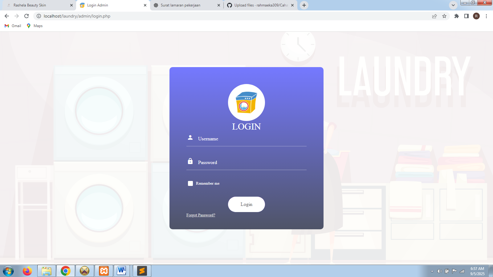
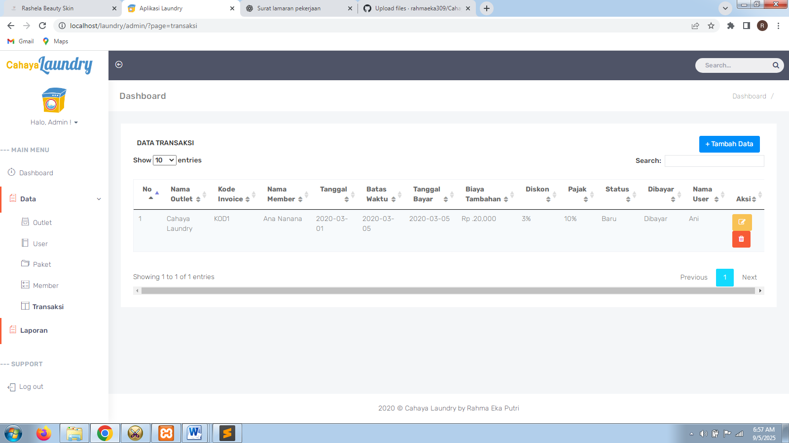

📄 README – Cahaya Laundry

📌 Cahaya Laundry Management System

A web-based application for managing operational data and transactions of a laundry business. This system is designed for **admin use only** (backend).

---

🚀 Features

### 🛠️ Backend (Admin)

* Admin login & logout
* Dashboard overview
* Manage Outlets (Add, Edit, Delete)
* Manage Users (Add, Edit, Delete)
* Manage Packages (Add, Edit, Delete)
* Manage Members (Add, Edit, Delete)
* Manage Transactions (Add, Edit, Delete)

  * Transactions are linked with outlet, user, package, and member data

---

🛠 Tech Stack

* **Programming Language**: PHP, HTML, CSS
* **Framework/Library**: Native PHP + Bootstrap
* **Database**: MySQL
* **Tools**: XAMPP (Apache, PHP, MySQL), phpMyAdmin, Sublime Text

---

 Project Structure

```plaintext
/cahaya-laundry
 ┣ 📂 assets        # css, js, bootstarp, img, plugin
 ┣ 📂 lib           # db connection
 ┣ 📂 admin         # dashboard, CRUD pages, login page
 ┣ 📜 login-page.png
 ┣ 📜 dashboard-page.png 
 ┣ 📜 transaction-page.png      
 ┣ 📜 README.md
 ┗ 📜 dblaundry.sql  # SQL file to import database
```

⚙ Installation & Usage

1. Clone the repository

   ```bash
   git clone https://github.com/rahmaeka309/Cahaya-Laundry.git
   ```
2. Move the project to XAMPP `htdocs` folder

   ```
   C:\xampp\htdocs\laundry
   ```
3. Import database

   * Open phpMyAdmin → Create new DB `dblaundry`
   * Import `dblaundry.sql`
4. Run project

   * Start Apache & MySQL in XAMPP
   * Open browser → [http://localhost/laundry](http://localhost/laundry)
5. Default login

   * Username: `admin`
   * Password: `admin`

---

 Screenshots

* Login Page

* Dasboard

* Transaction Page


---

📈 Future Improvements

* Add role for cashier and customer
* Generate transaction report (PDF/Excel)

---

💻 Author

**Rahma Eka Putri**

* 📧 Email: [rahmaputri552@gmail.com](mailto:rahmaputri552@gmail.com)

* 🌐 GitHub: [github.com/rahmaputri309](https://github.com/rahma309)
